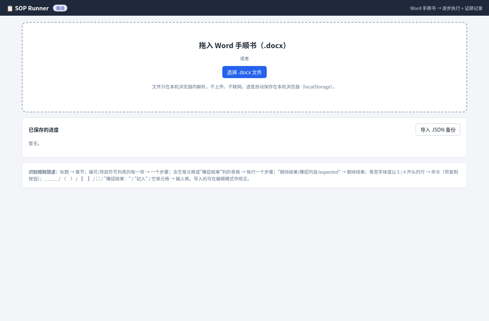
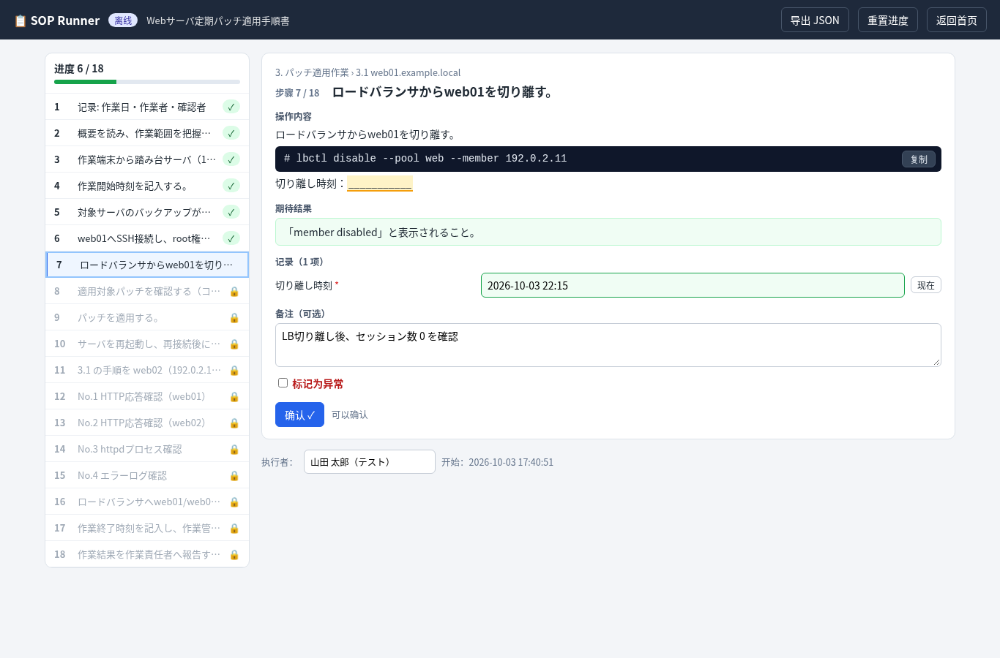
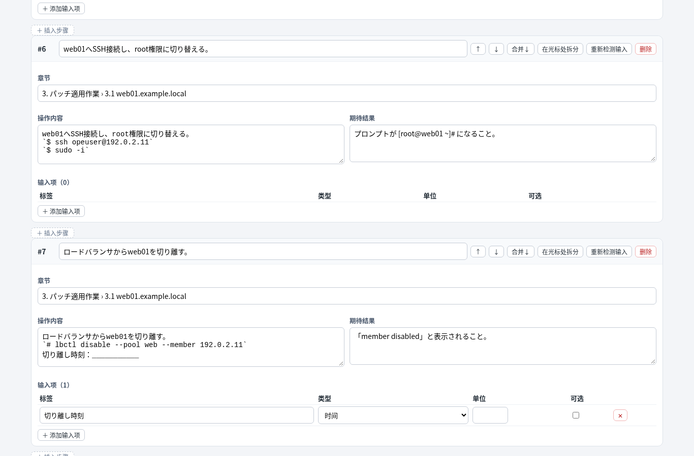
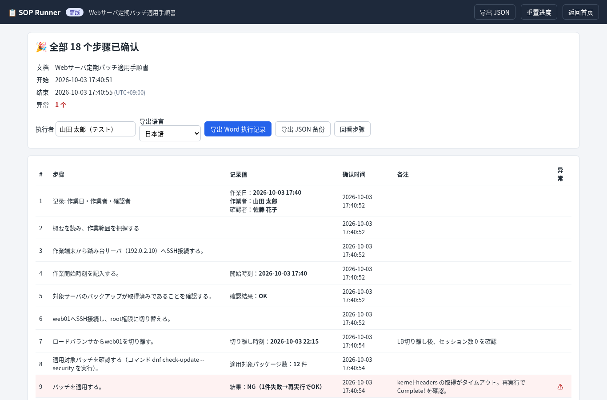

**English** · [简体中文](README.zh-CN.md) · [日本語](README.ja.md)

# SOP Runner

SOP Runner is an offline, single-file HTML tool for carrying out a Word procedure (an SOP / 手順書) one step at a time and keeping an execution record. Open `sop-runner.html` in a browser and drag in a `.docx` file. The page splits the document into steps, shows one step at a time with commands you can copy, and adds input boxes wherever a value has to be written down. You confirm each step before the next one unlocks. At the end it downloads a Word execution record you can keep as evidence. The file makes no network requests: its Content-Security-Policy blocks every external connection, and the libraries it uses (JSZip 3.10.1) are embedded in the HTML.

The on-screen labels are in Chinese. The sample procedure is in Japanese. The Word export defaults to Japanese labels and can be switched to Chinese.

## Features

- Import a `.docx` by dragging it onto the page or by using **选择 .docx 文件**. Older `.doc` files are refused; in Word, use Save As and choose `.docx`.
- Split the document into steps automatically:
  - Headings (Word heading styles such as Heading / 見出し / 标题, an outline level, or a short bold line such as `第1章` or `1. 事前準備`) become section titles.
  - Each top-level numbered item becomes its own step. A top-level bullet does too, unless it sits under a numbered step; those bullets stay in that step.
  - A table with empty cells, blank markers, or a result column (for example `確認結果`) becomes one step per row when the first row looks like column headers. Otherwise the whole table becomes one step.
  - Lines labeled 期待結果, 確認内容, 判定基準, expected result, and similar labels are shown separately as the expected result.
- Show one step at a time. Future steps stay locked until you confirm the current one.
- Render monospace lines and shell prompts (`$`, `#`, `PS>`, and similar) as command blocks. **复制** copies the command with the prompt removed. Inline code has its own copy button.
- Generate an input box when the text must be filled in. Markers include `＿＿＿` and `___`, empty brackets such as `（　）`, `【　】`, `［　］`, `[ ]`, and `「　」`, a `（記入）` marker, `□` / `☐`, a label that ends with an empty colon such as `確認結果：` or `記入：`, and empty cells in a record table. A sentence that says to fill something in (`記入`, `填写`, `填入`) is also picked up when the step has no stronger blank.
- Guess the field type: time (for example `作業日` or `時刻`, with a **现在** button), result (`結果` / `判定`, with **OK** / **NG** buttons), checkbox, or plain text. A unit written right after the blank (such as `件`) is kept.
- Require every non-optional field before **确认** is enabled. Each step also has an optional note and a **标记为异常** checkbox.
- Edit the outline before you start, and return to it with **重置进度** (entered values are cleared; the edited steps remain):
  - Change the section, title, instructions, and expected result.
  - Move a step up or down, merge it with the next step, or split it at the cursor in **操作内容**.
  - Insert or delete a step.
  - Add, delete, or re-detect inputs, and set each field’s label, type (文本 / 时间 / 结果(OK/NG) / 勾选), unit, and whether it is optional.
  - In the instruction text, wrap a whole line in backticks to mark a command, and use inline backticks for inline code. **重新检测输入** runs detection again after you edit the text.
- Resume a saved run from the home page, or continue when you drop the same unchanged file again.
- Export a landscape A4 Word record (`simple-table` layout) and a JSON backup. The executor name is required for both starting a run and exporting Word.

## Get the file

There is no installer. Download [`sop-runner.html`](sop-runner.html) from this repository (the copy in the repository root is the program) and open it by double-clicking. After the file is on your computer, running it does not need a network connection. This repository has no GitHub Release; the HTML file in the tree is what you use.

On a company PC, check the browser first:

1. Download [`js-test.html`](js-test.html) from the same repository.
2. Double-click it and click **点我测试**.
3. A green message means this computer allows local HTML and JavaScript, so `sop-runner.html` can run. The same page reports whether `localStorage` is available (that is what keeps your progress).
4. If the click does nothing, JavaScript is blocked for local files. Try Microsoft Edge or Google Chrome, or ask IT. The test page does not connect to the network and does not read any file.

You can also try the fictional sample [`sample/Webサーバ定期パッチ適用手順書.docx`](sample/Webサーバ定期パッチ適用手順書.docx).

## Usage

1. Open `sop-runner.html`.
2. Drop a `.docx` onto the dashed area, or click **选择 .docx 文件**. The home page states that the file is parsed only in this browser.
3. If this browser already has progress for the same file name and the same file contents, choose **确定** to continue or **取消** to parse again and replace that progress.
4. You land in edit mode. Fix any step that was split badly, fill in **执行者** (required), then click **开始执行**.
5. Work the highlighted step. Copy commands, fill the record fields, and add a note or mark an anomaly if you need to. **确认** stays disabled until the required fields are filled. Confirming the last step opens the completion page.
6. Use the left-hand list to revisit a step you already confirmed. You can undo the confirmation of the step immediately before the current one. Steps you have not reached stay locked.
7. On the completion page, check the summary, choose **导出语言** (**日本語** by default, or **中文**), and click **导出 Word 执行记录**. The download is named `{procedure name}_実施記録_{YYYYMMDD-HHmm}.docx` in both languages. **导出 JSON 备份** writes `{procedure name}_run_{YYYYMMDD-HHmm}.json` for your own archive.
8. **返回首页** leaves the run in the saved-progress table. **继续** opens it again. **删除** removes that saved run from this browser. **导入 JSON 备份** restores a backup file you exported earlier. **重置进度**, while a run is open, clears recorded values, notes, and confirmation times and sends you back to edit mode; it keeps the steps you edited.

## Progress and privacy

Progress is stored in this browser’s `localStorage`, under keys that start with `sopRunner:v1:` followed by the file name and a hash of the file bytes. Changing the Word file produces a different hash, so it is kept as a separate run. The executor name is also remembered in this browser under `sopRunner:executor` and is filled in the next time you start. Every edit is written immediately. If the browser refuses the write, the page shows a save-failure message.

The page’s Content-Security-Policy is `default-src 'none'` with `connect-src 'none'`. Parsing, the saved run, and the export all stay on this machine. A Word or JSON download is a file you save yourself. Clearing site data for the page’s origin removes the saved runs.

## Requirements

Use a current browser that runs JavaScript in local HTML files. `js-test.html` names Microsoft Edge and Google Chrome when a click produces no result. Automatic progress needs `localStorage`. The procedure has to be a `.docx` file (Office Open XML).

## Do not commit real procedures

Do not commit real SOPs, execution records, or other company data to this repository. The file in [`sample/`](sample/) is fictional. [`sample/make_sample.py`](sample/make_sample.py) generates it, and the document itself says it is a sample. The host names in it are documentation names (`example.local`, `192.0.2.0/24`).

## In this repository

| Path | What it is |
| --- | --- |
| [`sop-runner.html`](sop-runner.html) | The single file you open |
| [`js-test.html`](js-test.html) | Local HTML + JavaScript check |
| [`sample/`](sample/) | Fictional procedure and the script that builds it |
| [`src/`](src/) | `parser.js` (splitting and input detection), `export.js` (Word export), `app.js` (the page), `app.css`, `template.html` |
| [`build/build.js`](build/build.js) | Assembles `src/` and JSZip into `sop-runner.html`. JSZip is read from `build/node_modules` (`jszip` is listed in [`build/package.json`](build/package.json)); the HTML already in the repository contains it |
| [`tests/`](tests/), [`run_tests.sh`](run_tests.sh) | Playwright end-to-end test, export check, and offline scan. `./run_tests.sh` rebuilds the HTML and reruns them |
| [`screenshots/`](screenshots/) | The pictures above |

Word export is three layers in `src/export.js`: `RecordModel.build()` (the data), `ExportTemplates[name].render()` (the layout), and `DocxWriter.pack()` (the `.docx` package). The page exports with the `simple-table` template. Another company form is a new `ExportTemplates` entry — for example, embed that form’s `word/document.xml`, replace placeholders such as `{{executor}}`, and repeat the table row.

License: [MIT](LICENSE).
